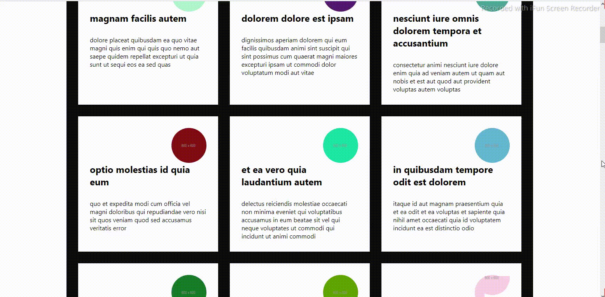
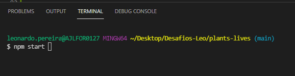
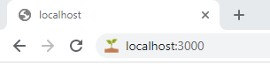

<h1>Buscando dados externos com fetch (Data fetching)</h1>

<h3 id="instrucoes">Instruções para rodar o projeto na sua máquina</h3>

 

1 - Faça fork (clone) do projeto

2 - Abra um terminal e acesse a pasta do projeto

3 - Instale o package “node_module” com o comando ***npm install***

 

 

4 - Depois de instalado o package, digite o comando npm start ou yarn start (caso tenha o yarn instalado)

 

 

5 - Em seu navegador de preferência, digite o endereço ***http://localhost:3000***

 

 

<h3 id="autor">Autor</h3> 

 Meu nome é Leonardo, mas gosto de ser o Leo. Estou me graduando em Sistemas de Informação. Sou Desenvolvedor Front-End (estagiário) na AjaxTI.
 

<h3 align=center><i>Gostos e Hobbies </i>📖🙋‍♂️</h3>  

Caminhar, correr, ciclismo, exercícios físicos, estudar, ler e aprender sobre desenvolvendo de sites e aplicações.
 

    <h3><strong>Contatos</strong></h3>
     
    
    &nbsp;&nbsp;&nbsp;&nbsp;&nbsp;&nbsp;&nbsp;&nbsp;&nbsp;
     
    &nbsp;&nbsp;&nbsp;&nbsp;&nbsp;&nbsp;&nbsp;&nbsp;&nbsp;
       
    &nbsp;&nbsp;&nbsp;&nbsp;&nbsp;&nbsp;&nbsp;&nbsp;&nbsp;
    

